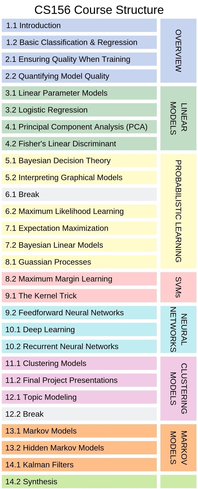

# CS156
### Machine Learning for Science and Profit

Students learn to apply core machine learning techniques — such as classification, perceptron, neural networks, support vector machines, hidden Markov models, and nonparametric models of clustering — as well as fundamental concepts such as feature selection, cross-validation and over-fitting. Students program machine learning algorithms to make sense of a wide range of data, such as genetic data, data used to perform customer segmentation or data used to predict the outcome of elections.

### Course Structure

## Prerequisites

- **CS110:** Computation: Solving Problems with Algorithms
- **CS111A:** Continuous Mathematical Systems
- **CS111B:** Linear Mathematical Systems